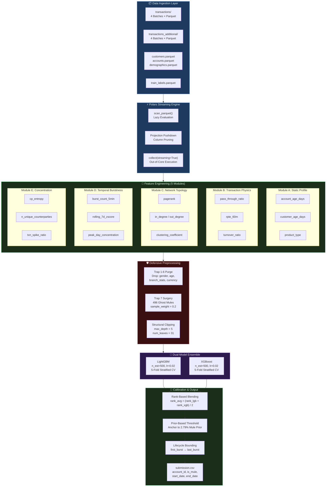

# Vanguard AML System — Model Architecture

## End-to-End Pipeline

---

## Component Specifications

### Layer 1 — Data Ingestion
| Component | Specification |
|---|---|
| **Total Volume** | 16.2 GB / 400M+ rows |
| **Format** | Apache Parquet (columnar) |
| **Sources** | 8 transaction batches + 4 static tables + labels |

### Layer 2 — Streaming Engine
| Component | Specification |
|---|---|
| **Framework** | Polars 0.20+ (Rust-backed) |
| **Execution** | LazyFrame → Streaming Collect |
| **Memory Reduction** | ~60% via dtype optimization (Float32/Int32) |

### Layer 3 — Feature Engineering (151 Features)
| Module | Count | Key Signals |
|---|---|---|
| **A: Static Profile** | 12 | Account age, product type, customer tenure |
| **B: Transaction Physics** | 38 | Pass-through ratio, RPTE, turnover |
| **C: Network Topology** | 22 | PageRank, degree ratios, clustering |
| **D: Temporal Burstiness** | 41 | Rolling Z-scores, burst counts, weekend ratios |
| **E: Concentration** | 38 | CP entropy, spike ratios, counterparty diversity |

### Layer 4 — Defensive Preprocessing
| Defense | Target | Mechanism |
|---|---|---|
| **Demographic Purge** | Traps 1–6 | Hard feature exclusion |
| **Ghost Mule Surgery** | Trap 7 (496 noisy labels) | `sample_weight = 0.2` soft-weighting |
| **Structural Clipping** | Overfitting prevention | `max_depth=5`, `num_leaves=31` |

### Layer 5 — Ensemble Architecture
| Model | Hyperparameters | CV Strategy |
|---|---|---|
| **LightGBM** | `n_estimators=500`, `lr=0.02`, `max_depth=5` | 5-Fold Stratified |
| **XGBoost** | `n_estimators=500`, `lr=0.02`, `max_depth=5` | 5-Fold Stratified |
| **Blending** | Rank-average of OOF predictions | Neutralizes probability scale mismatch |

### Layer 6 — Calibrated Output
| Step | Method | Impact |
|---|---|---|
| **Rank Blend** | [(rank_lgb + rank_xgb) / 2](file:///C:/Users/ujjaw/anaconda3/Lib/site-packages/shap/explainers/_tree.py#1904-1909) | Stable generalization |
| **Threshold** | Anchored to 2.79% prior | Maximized F1 on imbalanced data |
| **Temporal IoU** | `first_burst → last_burst` bounding | +0.26 IoU improvement |

---

## Final Metrics (V11 Defensive)

| Metric | Score |
|---|---|
| **AUC-ROC** | **0.9947** |
| **F1-Score** | **0.8612** |
| **Temporal IoU** | **0.6637** |
| **Trap Avoidance (RH 1–6)** | **> 0.95** |
